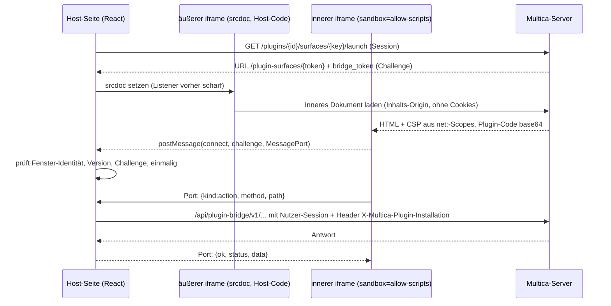

# Multica-Plugin-System — Funktionsweise

Analyse des Standes `c78d605fc` (Branch `claude/multica-plugin-analysis-4388e0`, Basis Upstream v0.6.0
plus Careli-Erweiterung CA-431). Grundlage ist der Quelltext in diesem Repository; Aussagen mit
Dateipfad sind dort nachlesbar. Was nicht gelesen oder ausgeführt wurde, steht in
[Grenzen der Analyse](#grenzen-der-analyse).

## 1. Worum es geht

Ein **Plugin** erweitert eine Multica-Workspace um Oberfläche, Automatisierung und Agent-Werkzeuge,
ohne dass der Plugin-Autor Code im Multica-Prozess ausführt. Das Modell steht in der Kopfdokumentation
von [`server/pkg/plugincontract/manifest.go`](../../server/pkg/plugincontract/manifest.go):

| Beziehung | Richtung | Mechanismus |
|---|---|---|
| **Action** | Plugin → Multica | Plugin ruft Host-Funktionen (Issues, Kommentare, Storage, Kontext) |
| **Hook** | Multica → Plugin | Host ruft einen HTTPS-Endpunkt oder MCP-Server des Autors |
| **Resource** | keiner | Statischer Beitrag, aktuell nur `skill` (eine `SKILL.md`) |

„Wer löst aus“ (Trigger) und „was wird aufgerufen“ (Hook) sind getrennt: Ein Hook wird einmal
deklariert und kann von jedem Trigger ausgelöst werden, den er auflistet.

Feature-Flag: `plugins_v1` ([`server/internal/featureflags/keys.go`](../../server/internal/featureflags/keys.go)).
Ist es aus, sind Action-/Bridge-API, Surface-Launch, Event-/Schedule-Dispatch und Agent-Tools abgeschaltet.
Der Event-Pfad prüft das Flag **pro Zustellung**, ein Umlegen wirkt also sofort und nicht erst nach
Neustart.

> **Abgrenzung.** `server/internal/daemon/claude_plugins.go` gehört nicht zu diesem System. Die Datei
> liest, welche *Claude-Code*-Plugins auf dem Daemon-Host aktiviert sind (nur den Dateikopf geprüft).
> Dasselbe gilt für Claude-Code-Plugins wie `multica-ultimate-workbench` auf dieser VM.

Ein konkretes Plugin auf diesem System ist das Wissens-Plugin mit A2A-Anbindung an LiteLLM:
siehe [wissen-plugin.md](wissen-plugin.md).

## 2. Bausteine im Überblick

```
┌──────────────────────────── Autor ────────────────────────────┐
│ multica.plugin.json + ui/main.js (+ skills/*/SKILL.md)  → ZIP │
│ eigener HTTPS-Hook-Server / eigener MCP-Server (läuft beim    │
│ Autor, nie bei Multica)                                       │
└───────────────┬───────────────────────────────▲───────────────┘
        Publish │                               │ signierter POST (Hook)
                ▼                               │ bzw. MCP-Aufruf
┌──────────────────────── Multica-Server (Go) ──┴───────────────┐
│ plugincontract   Manifest/Bundle-Validierung, Scopes          │
│ service/plugin*  Publish, Install, Config, Hook-Engine, Token │
│ handler/plugin*  Bridge-/Public-API, Surface-Hosting          │
│ scheduler        Cron-Trigger (DB-gestützt)                   │
│ PostgreSQL       Pakete, Versionen, Dateien, Installationen   │
└───────▲───────────────────────────────▲───────────────────────┘
        │ /api/plugin-bridge/v1         │ /api/daemon/tasks/{id}/plugin-hooks
        │ (Browser-Session des Nutzers) │
┌───────┴───────────────┐       ┌───────┴───────────────────────┐
│ Web/Desktop (React)   │       │ Daemon → lokaler MCP-Server   │
│ packages/views/plugins│       │ „multica-plugins“ → Agent     │
│ iframe + SDK-Bridge   │       └───────────────────────────────┘
└───────────────────────┘
```

| Schicht | Ort |
|---|---|
| Vertrag (Manifest, Scopes, Bundle, Capabilities) | [`server/pkg/plugincontract/`](../../server/pkg/plugincontract/) |
| Öffentlicher API-Vertrag (`/v1`, OpenAPI) | [`server/pkg/publicapi/v1/`](../../server/pkg/publicapi/v1/) |
| Geschäftslogik | [`server/internal/service/plugin*.go`](../../server/internal/service/) |
| HTTP-Handler | [`server/internal/handler/plugin*.go`](../../server/internal/handler/) |
| Scheduler-Job | [`server/internal/scheduler/jobs_plugin_hook.go`](../../server/internal/scheduler/jobs_plugin_hook.go) |
| Daemon (Agent-Seite) | [`server/internal/daemon/plugin_hook_mcp.go`](../../server/internal/daemon/plugin_hook_mcp.go) |
| Client-Logik (Query/Mutation/Typen) | [`packages/core/plugins/`](../../packages/core/plugins/), [`packages/core/types/plugin.ts`](../../packages/core/types/plugin.ts) |
| UI und Bridge-Host | [`packages/views/plugins/`](../../packages/views/plugins/), [`plugins-tab.tsx`](../../packages/views/settings/components/plugins-tab.tsx) |
| SDK für Autoren | [`packages/plugin-sdk/`](../../packages/plugin-sdk/) |
| Beispiele | [`examples/plugins/`](../../examples/plugins/) |

## 3. Das Manifest

Datei `multica.plugin.json`, geprüft von `ParseManifest` — **strikt**: unbekannte Felder und
Folge-JSON werden abgelehnt, damit ein Tippfehler keine Berechtigung stillschweigend verändert. Das
kanonisch neu kodierte Manifest wird später als „zugestimmter Snapshot“ gespeichert.

| Feld | Regel |
|---|---|
| `manifest_version` | genau `1` |
| `key` | Reverse-DNS, mind. 2 Segmente (`com.example.deploy-sentinel`), ≤ 255 Byte |
| `version` | SemVer, ≤ 64 Byte |
| `scopes` | nicht leer, ≤ 64, geschlossene Liste (s. u.) |
| `config` | ≤ 32 Felder, Typen `string`/`number`/`bool`/`enum`/`secret`; Host rendert das Formular |
| `contributes` | ≥ 1 und ≤ 64 Beiträge aus `surfaces`, `hooks`, `resources` |

**Scopes** (geschlossen): `projects:read|write`, `workspace:read|write`, `issues:read|write`,
`comments:read|write`, `tasks:read|write`, `agents:read`, `members:read`, `storage:user`,
`storage:workspace` und `net:<domain>`. `net:` ist der einzige parametrisierte Scope und
**exakter Host**, kein Suffix-Match — dieselbe Zeichenkette steuert Einwilligungsdialog,
Hook-Zielprüfung und iframe-CSP.

**Surfaces** (`issue_panel`, `project_panel`, `workspace_panel`, `sidebar_panel`, `modal`): `entry`
muss ein `.js`/`.mjs` sein. Der Host erzeugt das HTML selbst, damit er die aus `net:` abgeleitete CSP
setzen kann.

**Hooks**: Pflichtfelder `key`, `name`, `description` (wird für Agenten zur MCP-Tool-Beschreibung),
`triggers`, `transport {type, url}`; optional `input_schema` (Objekt), `events`, `schedule`,
`timeout_ms` (100–30000 ms).

- Trigger: `ui`, `manual`, `agent`, `event`, `schedule`.
- `event` verlangt `events` aus sieben bekannten Ereignissen (siehe §7). Jedes Ereignis erzwingt den
  Lese-Scope, den man zum Abholen derselben Daten bräuchte (`issue.*` → `issues:read`,
  `comment.created` → `comments:read`, `task.*` → `tasks:read`): Abonnieren ist kein Weg, Inhalte ohne
  Lese-Recht zu erhalten.
- `schedule` verlangt `cron` (5 Felder, ohne `TZ=`-Präfix) und `timezone`, nur mit `http`-Transport,
  mindestens 5 Minuten Abstand (geprüft über ein 400-Tage-Fenster).
- Transport `http` oder `mcp`; die URL muss HTTPS sein und der Host durch einen `net:`-Scope gedeckt.

**Resources**: nur `type: "skill"`, `entry` muss exakt `skills/<key>/SKILL.md` lauten.

### Capability-Gate

[`capabilities.go`](../../server/pkg/plugincontract/capabilities.go) beschreibt, was **dieser Build**
ausführen kann, getrennt vom Schema. Alles Deklarierte, was fehlt, lässt Publish und Install laut
scheitern (alle Lücken auf einmal). Aktuell aktiv: Surfaces `issue_panel`, `project_panel`,
`workspace_panel`, `modal`; alle fünf Trigger; Transporte `http` und `mcp`; Resource `skill`.
**`sidebar_panel` ist aus** — es hat keinen Einbauort im Host, und ein installierbares, aber nie
sichtbares Plugin soll es nicht geben.

## 4. Lebenszyklus

```
 ZIP hochladen ──► Publish ──► Preview ──► Install ──► Config ──► Token ──► (MCP-Approval)
 (Admin)           unveränderl.  Scopes     exakte     Formular   mpi_ +     nur bei
                   Version       sehen      Zustimmung            whsec_     mcp-Hooks
```

Alle Verwaltungsrouten (`POST /api/workspaces/{id}/plugins/...`) sind **Owner/Admin**. Lesen
(`GET /plugins`) und der Surface-Launch sind für Mitglieder offen, damit Issues Panels zeigen können
([`router.go`](../../server/cmd/server/router.go)).

1. **Publish** (`POST /plugins/packages`, oder `…/local` aus `MULTICA_PLUGIN_DIR` für die Entwicklung).
   `ParseBundle` validiert Manifest und alle referenzierten Dateien; die Version ist **unveränderlich**.
   Erneutes Publizieren derselben Version ist ein 409. Der lokale Entwicklungsweg hängt stattdessen
   `+dev.N` an. Grenzen: Archiv 2 MiB, Datei 1 MiB, Summe 4 MiB, 512 Einträge, `SKILL.md` 256 KiB. Zip-Slip,
   Symlinks und Backslashes werden abgelehnt; Oberflächen-Skripte werden mit einem JS-Parser geprüft
   und dürfen kein Top-Level-`import`/`export`/`await` oder `import.meta` enthalten (eine Datei, kein
   Modulgraph). Alles landet in einer Transaktion unter einem transaktionsbezogenen Lock je (Workspace, Plugin-Key)
   in `plugin_package`, `plugin_package_version`, `plugin_package_file`. Dateien liegen bewusst in
   Postgres, nicht in Objektspeicher: Manifest und Code committen und wiederherstellen gemeinsam.
2. **Preview** (`POST /plugins/preview`) schreibt nichts, liefert Manifest, Scopes, Config-Schema und
   — bei bestehender Installation — `added_scopes`.
3. **Install** (`POST /plugins`): `granted_scopes` muss **exakt** mit den Manifest-Scopes übereinstimmen
   (Teilzustimmung würde ein stilles Halb-Plugin erzeugen). Eine Transaktion legt die Installation an,
   schreibt Skill-Resources und gleicht Schedules ab. Die Installation ist an **eine** Version gebunden
   und enthält den Manifest-Snapshot; eine spätere Publikation ändert nichts, bis ein Admin upgradet.
   **Upgrade** ist derselbe Aufruf mit neuer Versions-ID: Config wird auf noch deklarierte Felder
   gestutzt, verwaiste Secrets gelöscht, Skills neu synchronisiert.
4. **Config** (`PUT …/config`): Werte werden gegen den *gespeicherten* Manifest-Snapshot validiert.
   Normale Werte gehen in `plugin_installation.config`, `secret`-Felder verschlüsselt (`secretbox`,
   Schlüssel `MULTICA_PLUGIN_SECRET_KEY`) in `plugin_secret`. Secrets sind schreibgeschützt, kein
   Endpunkt gibt sie zurück, nicht einmal maskiert; leere Eingabe löscht. Ohne Schlüssel scheitern
   Secret-Schreibzugriffe geschlossen.
5. **Token** (`POST …/token`): erzeugt den Install-Token `mpi_…` (nur SHA-256-Hash gespeichert, einmal
   sichtbar, Rotation statt Wiederherstellung) und zeigt das Signing-Secret `whsec_…`.
6. **Enable/Disable** blendet alle Beiträge sofort aus, behält Storage und Secrets und pausiert
   Schedules. **Uninstall** löscht in einer Transaktion Schedules, Storage, Secrets, Invocations,
   zugehörige Skills und die Installation (kein FK/Cascade per Repo-Regel). Ein Paket lässt sich nur
   löschen, solange keine Installation es nutzt.

## 4a. Ablage in der Datenbank

Die alten 14 Tabellen des ersten Entwurfs (Migrationen 285–326: Releases, Grants, Bindings,
Snapshots, Execution-Manifeste) wurden mit Migration `344_plugin_v2_reset` vollständig entfernt. Es
gab nie Produktivdaten. Danach löste Migration `392` das URL-basierte Modell durch gehostete Pakete
ab. Heute relevant:

| Tabelle | Inhalt |
|---|---|
| `plugin_package` / `plugin_package_version` / `plugin_package_file` | veröffentlichte, unveränderliche Artefakte (Manifest, Digest, Dateien als `BYTEA`) |
| `plugin_installation` | je Workspace und Plugin: Version, Manifest-Snapshot, `granted_scopes`, `config`, `enabled`, `token_hash`, `mcp_approvals` |
| `plugin_secret` | verschlüsselte `secret`-Felder |
| `plugin_storage` | Key/Value je Scope `workspace` oder `user` |
| `plugin_invocation` | Hook-Aufrufprotokoll (Status, Latenz, redigierter Fehler, **ohne Payload**, 7 Tage Aufbewahrung) |
| `plugin_hook_schedule` | Ausführungsprojektion der Cron-Hooks (Generation, `activated_at`) |
| `comment.via_plugin_id`, `skill.plugin_installation_id` | Herkunftsmarker |

`comment.author_type` kennt zusätzlich den Wert `plugin` (Migration 362).

## 5. Oberfläche: wie ein Surface sicher läuft

Ein Surface ist **ein** Skript im iframe. Es hält keine Zugangsdaten und erreicht Multica nur über
den Host. Das ist der Kern des Sicherheitsmodells.



- **Zwei Frames.** Der äußere (`buildSurfaceFrameDocument`, [`surface-document.ts`](../../packages/views/plugins/surface-document.ts))
  ist Host-Code mit CSP `frame-src <Inhalts-Origin>`. Der innere ist
  `sandbox="allow-scripts"` **ohne** `allow-same-origin`, hat also eine opake Origin; zwei Plugins
  sehen sich nicht.
- **Eigene Inhalts-Origin.** `MULTICA_PLUGIN_SURFACE_ORIGIN` muss sich von App-, API- und Anhang-Origin
  unterscheiden; sonst verweigert der Launch. Dort ist nur `/plugin-surfaces/*` erreichbar
  (`PluginSurfaceHostBoundary`). Kommt ein `Cookie` oder `Authorization` an, antwortet der Server mit
  400 — ein zu breites Eltern-Domain-Cookie soll sichtbar scheitern.
- **Launch-Token.** AES-GCM-versiegelte Claims (Workspace, Installation, Version, Surface,
  Digest, Challenge), TTL 2 Minuten, mit eigenem aus dem Plugin-Schlüssel abgeleiteten Schlüssel.
  Beim Ausliefern werden Installation, Enabled-Status, Version und Digest erneut geprüft.
  Der Token wird serverseitig nicht „verbraucht“; **einmalig** ist die Challenge im Bridge-Handshake.
- **CSP des inneren Dokuments:** `default-src 'none'`, `connect-src` nur `https://<net:-Domain>`
  je Scope (sonst `'none'`), keine Frames, Objekte, Formulare.
- **Bindung der Bridge** an Fenster-Identität, Protokollversion 2, Challenge und den vom Gast
  erzeugten `MessagePort`, nicht an `event.origin` (wäre immer `"null"`).
- **Pfad-Allowlist im Host** ([`surface-bridge.ts`](../../packages/views/plugins/surface-bridge.ts)):
  `/context`, `/issues/{id}`, `/issues/{id}/comments`, `/storage/{workspace|user}[/key]`,
  `/hooks/{key}`. Alles andere wird vor dem `fetch` mit 400 abgewiesen. Bei Hook-Aufrufen überschreibt
  der Host `issue_id`/`project_id` mit dem Einbauort — das Surface kann das Ziel nicht umlenken.
  Wichtig: Die Projekt-/Workspace-Kontext-Endpunkte (§9) stehen **nicht** in dieser Liste, ein
  iframe erreicht sie nicht direkt.
- **Zwei Grenzen gleichzeitig:** die vom Admin erteilten Scopes **und** das, was der angemeldete Nutzer
  selbst darf. Ein Mitglied ohne Zugriff auf ein Issue erhält auch über das Plugin 404, ein nicht
  erteilter Scope ergibt 403 mit Scope-Name.

**Einbauorte** (alle nur bei `plugins_v1` und `enabled === true`):

| Surface-Typ | Ort |
|---|---|
| `issue_panel` | Issue-Detail ([`issue-detail.tsx`](../../packages/views/issues/components/issue-detail.tsx)), immer sichtbar |
| `project_panel` | Projekt-Detail ([`project-detail.tsx`](../../packages/views/projects/components/project-detail.tsx)), per Button aufklappbar |
| `workspace_panel` | Workspace-Einstellungen ([`workspace-tab.tsx`](../../packages/views/settings/components/workspace-tab.tsx)), per Button aufklappbar |
| `modal` | öffnet sich nur, wenn ein Mensch im Issue-Menü zugreift ([`plugin-modal-surface.tsx`](../../packages/views/plugins/plugin-modal-surface.tsx)) |
| `manual`-Hook | Eintrag im Issue-Aktionsmenü und in der Befehlspalette ([`plugin-hook-actions.tsx`](../../packages/views/plugins/plugin-hook-actions.tsx)) |

`platforms` (`web`/`desktop`) ist ein Filter, kein Hinweis. Admin-Verwaltung liegt im Tab
„Plugins“ ([`plugins-tab.tsx`](../../packages/views/settings/components/plugins-tab.tsx)).

### SDK für Autoren

[`@multica/plugin-sdk`](../../packages/plugin-sdk/README.md), ohne Laufzeitabhängigkeiten, in eine
einzelne Datei zu bündeln:

```js
const ctx = await multica.context.get();           // Workspace, Nutzer, Issue, Config, net-Domains
const issue = await multica.issue.get();
await multica.issue.comment({ body: "hallo" });
await multica.storage.user.get("note");            // workspace | user
await multica.hooks.invoke("triage_issue", {...}); // ui-Trigger des eigenen Plugins
multica.ui.resize(320);                            // Frame wächst nicht automatisch
```

Fehler sind `MulticaPluginError` mit HTTP-ähnlichem `status`; Anfragen laufen nach 15 s in einen 408.
Das Theme (`--background`, `--foreground`, …) wird über die Bridge gepusht und als CSS-Variablen
gesetzt. Kein `localStorage`/Cookie im Frame, dafür `multica.storage`.

## 6. Action-API: drei Prüfungen

Zwei Zugänge zu denselben Handlern ([`registerPluginActionRoutes`](../../server/cmd/server/router.go)):

| Zugang | Pfad | Auth |
|---|---|---|
| Bridge (Surface) | `/api/plugin-bridge/v1` | Nutzer-Session + Header `X-Multica-Plugin-Installation` |
| Public API (Plugin-Server) | `/v1`, `MULTICA_PLUGIN_API_URL` | nur Bearer `mpi_`/`mpc_`, Rate-Limit `RATE_LIMIT_PLUGIN_API` (Standard 120/min) |

Jeder Aufruf durchläuft ([`handler/plugin_action.go`](../../server/internal/handler/plugin_action.go)):

1. Installation existiert und ist **enabled**.
2. Installation hat den nötigen **Scope**.
3. Der **Nutzer** darf die Ressource (normale Loader, keine zweite Rechtelogik).

Der Workspace kommt immer aus der Installation, nie aus einem Client-Header.

**Wer ist der Akteur?** Das entscheidet die Art der Authentifizierung, nicht eine Anfrageangabe:

| Authentifizierung | Akteur | Wirkung |
|---|---|---|
| Browser-Session (Surface) | der Nutzer | Schreibzugriffe gehören dem Nutzer, markiert mit `via_plugin_id` |
| Callback-Token eines `ui`/`manual`-Hooks | der drückende Nutzer | wie oben; Mitgliedschaft wird bei jedem Aufruf neu geprüft |
| Callback-Token eines `event`/`schedule`-Hooks | das Plugin | `author_type = plugin`, `author_id` = Installation |
| Install-Token | das Plugin | wie oben |

Endpunkte: `GET /context`, `GET|PATCH /issues/{ref}`, `GET|POST /issues/{ref}/comments`,
`GET|PUT|DELETE /storage/{scope}[/{key}]` sowie die Kontext-Endpunkte aus §9. Ein Kommentar des
Plugins löst **keine** `@mention`-Dispatch aus (ein Surface darf keine Agentenläufe anstoßen).
`/context` braucht keinen Scope und liefert nur nicht-geheime Config; E-Mail fehlt absichtlich.

**Storage** (`storage:user` und `storage:workspace`): Key ≤ 1 KiB, Wert ≤ 100 KiB, ≤ 1000 Keys,
5 MiB gesamt; Überschreitung ist ein Fehler, keine Verdrängung. `user`-Scope verlangt einen Menschen als
Akteur, damit nicht alle Plugin-Schreibzugriffe in einem Null-UUID-Eimer landen.

## 7. Hooks: Multica ruft das Plugin

Zentrale Logik: [`service/plugin_hook.go`](../../server/internal/service/plugin_hook.go).
Hooks lesen immer aus dem **Installations-Snapshot**, nie aus dem, was ein Server heute ausliefert.

**Ablauf je Aufruf (`InvokeHook`):** Installation aktiv? → Trigger im Manifest deklariert? →
Transport `http`? → Rate-Limit (120/min je Hook) → Zielprüfung → Body bauen → signieren → POST →
Aufruf protokollieren.

- **Zielprüfung:** Der Host muss in den erteilten `net:`-Scopes stehen, öffentlich auflösbar sein und
  wird beim Verbinden **erneut** aufgelöst (SSRF-Schutz gegen DNS-Wechsel auf private Adressen); keine
  Redirects. Ausnahme nur für vom Betreiber benannte Dev-Origins (`MULTICA_PLUGIN_DEV_ORIGINS`,
  optional mit `MULTICA_PLUGIN_DEV_CA`) — und auch dort bleibt die `net:`-Prüfung.
- **Request-Body (v1):** `invocation_id`, `delivery_id`, `attempt`, `hook_key`, `trigger`,
  `event_type`, `workspace_id`, `installation_id`, `issue_id`/`project_id`, `actor`, `input`, die
  **nicht-geheime** `config`, `callback_token`, `callback_url`, `schedule.planned_at`. Secrets werden nie
  mitgesendet.
- **Signatur:** Header `X-Multica-Timestamp`, `X-Multica-Signature: v1=<hex>`,
  `X-Multica-Plugin-Installation`. Der Wert ist `HMAC-SHA256(key, "<timestamp>.<body>")`; `key` wird aus
  `MULTICA_PLUGIN_SECRET_KEY` und der Installations-ID abgeleitet (nicht gespeichert; als `whsec_…` beim
  Token-Rotieren sichtbar). Toleranz ±5 Minuten gegen Replay, Vergleich in konstanter Zeit,
  `VerifyHookSignature` ist für Empfänger exportiert. Antwort: 2xx, JSON, ≤ 1 MiB.
- **Fehlerstatus:** `ok`, `failed`, `timeout`, `refused` (Entscheidung des Hosts, wird nie wiederholt).
  Fehlertexte werden redigiert, damit ein Endpunkt, der Eingaben zurückspiegelt, keine Issue-Inhalte in
  eine Tabelle ohne Löschpfad schreibt.

### Die fünf Trigger

| Trigger | Auslöser | Blockiert | Akteur | Ort |
|---|---|---|---|---|
| `ui` | Button im eigenen Surface (`multica.hooks.invoke`) | nur diese Anfrage | Nutzer | `POST /api/plugin-bridge/v1/hooks/{key}` |
| `manual` | Issue-Menü / Befehlspalette | nur diese Anfrage | Nutzer | wie oben |
| `event` | Ereignisbus des Hosts | **nie** den Host | Plugin | [`plugin_event_dispatch.go`](../../server/internal/service/plugin_event_dispatch.go) |
| `schedule` | Cron | **nie** den Host | Plugin | [`jobs_plugin_hook.go`](../../server/internal/scheduler/jobs_plugin_hook.go) |
| `agent` | Agent wählt das Werkzeug | nur den Agenten | Agent (siehe §11) | MCP, §8 |

`ui`/`manual` akzeptieren ausschließlich diese beiden Werte im Body; `event` und `agent` kann ein
Browser nicht anfordern. Ein Aufruf trägt entweder `issue_id` oder `project_id`, nicht beides.

**`event`.** `SubscribePluginEvents` bildet die internen Ereignisse auf sieben veröffentlichte Namen
ab: `issue.created`, `issue.updated`, `issue.status_changed` (abgeleitet aus `status_changed=true`
bei `issue:updated`), `comment.created`, `task.started`, `task.completed`, `task.failed`. Der
Bus-Listener läuft inline im auslösenden Request und reicht deshalb nur weiter. Die Arbeit passiert in
einem Pool (4 Worker, Queue 512; bei Überlauf wird verworfen und gezählt). Je Zustellung: 3 Versuche mit
Backoff (`Versuch × 2 s`); Refusals werden nicht wiederholt. Der Callback-Token wird auf das Issue des
Ereignisses eingeengt.

**`schedule`.** Der Scheduler-Job `plugin_hook_schedule_dispatch` plant je Schedule-Zeile und
**Generation** einen Scope; Änderung oder Wiederaktivierung startet eine neue Zeitlinie. Je Scope
strikt seriell, `CatchUpLatestOnly` (nach einem Ausfall wird nur das jüngste fällige Vorkommen
ausgeführt, übersprungene werden als `coalesced_occurrences` gezählt), 3 Versuche (Backoff 30 s,
2 min). `delivery_id` (`psd_…`) bleibt über Wiederholungen stabil — Empfänger können idempotent
arbeiten ([Beispiel](../../examples/plugins/schedule-pulse/README.md)). Läuft nicht bei geöffnetem
Circuit-Breaker, deaktivierter Installation oder geändertem Manifest.

**Circuit-Breaker:** 5 Fehler in 5 Minuten setzen die Hintergrundzustellung (`event`, `schedule`)
für diesen Hook aus.

### Callback- und Install-Token

| | Install-Token `mpi_…` | Callback-Token `mpc_…` |
|---|---|---|
| Richtung | Plugin-Server → Host | Host → Hook-Handler → Host |
| Lebensdauer | stehend, rotierbar | 5 Minuten, wird nach dem Aufruf widerrufen |
| Ablage | SHA-256-Hash in `plugin_installation` | **nur im Speicher** |
| Grenze | Scopes der Installation | Scopes der Installation + ein Aufruf + ein Issue/Projekt + festgelegter Akteur |
| Akteur | Plugin | wie beim Trigger (§6) |

Der Callback-Token gilt für **eine Invocation**, nicht für einen einzelnen Request: Ein Handler liest
typischerweise, entscheidet und schreibt dann — ein Einmal-Token hätte Autoren zum stärkeren
Install-Token gedrängt. Begrenzt bleibt er trotzdem: Ein Issue-Callback erreicht nur sein Issue (sonst
404, um die Existenz fremder IDs nicht zu bestätigen).

## 8. Agent-Trigger und MCP

```
Claim (Daemon) ──► plugin_hook_tools (http-Hooks)  ──► lokaler MCP-Server „multica-plugins“
                   remote_mcp_connections (mcp-Hooks) ─► vorhandener Remote-MCP-Broker
```

- **`http`-Hook als Werkzeug.** Beim Task-Claim liefert der Server `AgentHookTools` (nur aktive
  Installationen, Name stabil sortiert). Der Daemon startet pro Task einen MCP-Server auf
  `127.0.0.1` mit zufälligem Pfad-Token; Beschreibung und `input_schema` stammen **wörtlich** aus dem
  Manifest. Der Werkzeugname ist `<letztes Key-Segment>_<6 Hex Digest des Plugin-Keys>__<hook>`
  (injektiv, damit zwei Plugins nicht kollidieren). Ein Aufruf geht **zurück an den Server**
  (`POST /api/daemon/tasks/{id}/plugin-hooks`), nicht zum Plugin: Das Signing-Secret verlässt den Server nie,
  und Rate-Limit, Breaker, `net:`-Prüfung und Protokoll bleiben ein Codepfad. Die Installation muss zum
  Workspace des Tasks gehören. Fehler kommen als **200 mit Fehlertext** und werden im Daemon zu einem
  MCP-Tool-Fehler, den der Agent umgehen kann; ein toter Plugin-Endpunkt darf ein Issue nicht scheitern lassen.
- **Ziel-Bindung (neu, siehe unten).** Der Server bindet den Callback-Token eines Agent-Hooks an das, worum es
  in der Task geht: an das Projekt des Task-Issues, hat das Issue kein Projekt an das Issue selbst
  (`AgentHookScope` in [`plugin_agent_tools.go`](../../server/internal/service/plugin_agent_tools.go), aufgelöst in
  [`plugin_agent_hook.go`](../../server/internal/handler/plugin_agent_hook.go)). Ohne diese Bindung wäre der Token
  so weit gewesen wie das, was das Modell im Werkzeug-Input nennt. Ein Token mit Agent-Trigger darf außerdem den
  Workspace-Kontext **lesen** (nie schreiben); jeder andere gebundene Token bekommt dort weiterhin 403. Tasks ohne
  Issue (Chat, Autopilot) haben nichts, woran man binden könnte, und bleiben ungebunden. ID und Projekt stehen
  zusätzlich im signierten Body (`issue_id`/`project_id`), vom Host aufgelöst. **Restrisiken (Review):**
  (1) Tasks ohne Issue bleiben ungebunden: Ein Chat- oder Autopilot-Agent, dessen Modell per Prompt-Injection ein
  fremdes Issue als Ziel nennt, erreicht mit `issues:write`/`comments:write` den ganzen Workspace; Kommentare
  tragen `author_type = plugin`. (2) `storage:workspace` ist für gebundene Tokens nicht eingeengt; ein Agent von
  Projekt A kann Workspace-Speicher lesen und schreiben, den Projekt-B-Hooks befüllt haben (Seitenkanal, kein
  Zugriff auf fremde Issues oder Projekte). (3) `issue_id`/`project_id` im signierten Body gelten jetzt für **alle**
  Trigger, nicht nur für `ui`; ein Plugin, das „`issue_id` vorhanden“ als UI-Auflösung liest, verhält sich bei
  Agent-Hooks neu. Stand: committet im Arbeitszweig, nicht ausgerollt.
- **`mcp`-Transport.** Der Autor betreibt einen eigenen MCP-Server; dessen Werkzeuge ändert er
  zur Laufzeit selbst. Deshalb **pinnt** ein Admin sie ([`plugin_mcp_transport.go`](../../server/internal/service/plugin_mcp_transport.go)):
  `GET …/mcp/{hook}/tools` entdeckt (übernimmt nichts), `PUT` genehmigt nach Name **und** Schema-Digest.
  Nicht genehmigte oder verschobene Werkzeuge werden nicht gerufen; der Broker verweigert den Start,
  wenn ein genehmigtes fehlt oder sich verändert hat. Das Credential kommt aus dem Secret-Feld
  `<hook-key>_credential` und wird vom Daemon erst bei Verbindungsaufbau abgefragt
  (`GET /api/daemon/tasks/{id}/plugin-mcp/{contribution}/credential`), liegt also nie im Task-Datensatz.
  Fehlerpolitik `optional`. **Installation ist nicht die Freigabe, die Genehmigung der Werkzeuge ist es.**

## 9. Careli-Erweiterung CA-431: Projekt-/Workspace-Kontext

Commit `c78d605fc`, beschrieben in [`deploy/CONTEXT-EXTENSION.md`](../../deploy/CONTEXT-EXTENSION.md).
Fork-Basis ist Upstream v0.6.0; **keine DB-Migration**.

- **Neue Surfaces und Scopes:** `project_panel`, `workspace_panel` und `projects:*`/`workspace:*`.
- **Endpunkte** ([`handler/plugin_context_content.go`](../../server/internal/handler/plugin_context_content.go)):
  `GET|PATCH /v1/projects/{id}/context`, `GET|PATCH /v1/workspace/context`,
  `GET /v1/projects/{id}/issues` (jüngste 200 als Auswahl, Scope `issues:read`).
  Bei Projekten ist „Kontext“ die Projektbeschreibung, beim Workspace `workspace.context`.
- **Schreiben nur mit Mensch und Scope.** `can_write` ist `false`, wenn der Write-Scope nicht erteilt
  wurde (Commit „advertise context writes only when scope is granted“). Workspace-Schreiben braucht
  zusätzlich Owner/Admin.
- **Optimistische Sperre.** `PATCH` verlangt `content` **und** `expected_content` (je ≤ 100 000 Byte, ohne NUL);
  der Vergleich ist atomar in SQL (`CompareAndSwap…`, [`plugin_context.sql`](../../server/pkg/db/queries/plugin_context.sql)),
  ein veralteter Stand ergibt 409 `context_conflict` („neu laden, neuen Vorschlag prüfen“).
- **Bindung.** Ein Callback-Token trägt `ProjectID`. Er erreicht nur sein Projekt; Issue-gebundene Tokens
  erreichen gar kein Projekt, und Workspace-Kontext ist für jeden gebundenen Callback gesperrt.
  Die Bridge setzt `project_id` beim Hook-Aufruf selbst.
- **Ereignisse.** Erfolgreiche Schreibvorgänge senden `project:updated` bzw. `workspace:updated` mit
  `via_plugin_id`, damit andere Clients live nachziehen und die Herkunft erkennbar ist.
- **Datenfluss (abgeleitet, nicht im Fork-Dokument beschrieben).** Weil der iframe diese Pfade nicht
  direkt aufrufen darf (§5), bleibt für ein Projekt-Panel nur dieser Weg: Surface →
  `multica.hooks.invoke` → Hook-Server des Plugins → dessen Aufruf der Public API mit dem
  Callback-Token. Das Surface selbst erhält Projekt-ID und -Titel über `/context`.
- **Betrieb.** Eigene Images (`deploy/Dockerfile.context-backend`, `…-web`), `MULTICA_SERVER_PINNED=1`,
  Backup und Image-IDs vor dem Umstellen; Rollback und Ablauf stehen im Betriebsdokument. Spätere
  Upstream-Updates müssen diese Erweiterung zuerst portieren und testen.

## 10. Betriebskonfiguration

| Variable | Wirkung |
|---|---|
| `MULTICA_PLUGIN_SECRET_KEY` | 32-Byte-Schlüssel für Secrets, Hook-Signatur, Surface-Token und Callback-Token. Fehlt er: Secrets, Hooks und Surfaces sind aus (fail closed). |
| `MULTICA_PLUGIN_SURFACE_ORIGIN` | dedizierte, cookie-freie Inhalts-Origin für Surfaces |
| `MULTICA_PLUGIN_API_URL` | öffentlicher Host der Plugin-API; wird als `callback_url` gesendet. Leer: Ableitung aus der öffentlichen URL, ist auch die nicht gesetzt, enthält der Hook-Body keine `callback_url` (Warnung im Log). |
| `MULTICA_PLUGIN_DIR` | lokale Plugin-Quellen für den Entwicklungs-Publish |
| `MULTICA_PLUGIN_DEV_ORIGINS` / `MULTICA_PLUGIN_DEV_CA` | Opt-in für Dev-Hook-Endpunkte (z. B. `https://localhost:8787`) |
| `RATE_LIMIT_PLUGIN_API` | Public-API-Limit je Minute |

## 11. Beobachtungen

Beim Lesen aufgefallen. Punkt 4 ist behoben. Die Bindung der Agent-Aufrufe (früher eine offene Lücke, siehe §8 und
[wissen-plugin.md §12](wissen-plugin.md)) ist ebenfalls umgesetzt. Die Punkte 1 und 2 bleiben offen: Bei Punkt 1 ist
unklar, ob Kommentar oder Code gelten soll, Punkt 2 wäre eine Validierungsänderung, die der Eigentümer des
Manifest-Vertrags entscheiden sollte.

1. **Akteur bei `agent`-Hooks.** Der Kommentar in
   [`plugin_agent_tools.go`](../../server/internal/service/plugin_agent_tools.go) sagt, Schreibzugriffe seien
   die des Agenten. Der Callback-Token-Pfad in `pluginTokenCaller` setzt aber nur dann einen Menschen,
   wenn `grant.Actor.Type == "member"`; ein `agent`-Grant landet beim Akteur `plugin`. Kommentare, die ein
   Agent-Hook schreibt, tragen damit `author_type = plugin`. Entweder Kommentar oder Code ist
   zu korrigieren.
2. **`mcp`-Transport mit anderen Triggern.** `ParseManifest` erlaubt `transport.type: mcp` mit jedem Trigger,
   `InvokeHook` verweigert aber alles außer `http` („not supported yet“). Wirksam ist `mcp` nur mit
   `agent`. Ein Manifest mit `mcp` + `ui` installiert sich und scheitert erst beim Klick.
3. **Callback-Tokens liegen nur im Speicher.** Bei mehreren Server-Instanzen oder nach Neustart löst ein
   Token früher nicht mehr auf (der Handler sieht 403) — dokumentierte, bewusste Richtung, aber ein
   Betriebsthema bei horizontalem Skalieren.
4. **SDK-Typ driftete (behoben).** `PluginContext` im SDK kannte kein `project`-Feld, die Server-Antwort liefert es
   seit CA-431 (`ContextProject`). Der Typ trägt jetzt `project?: { id; title }`
   ([`packages/plugin-sdk/index.ts`](../../packages/plugin-sdk/index.ts)). `tsc` lief nicht (keine installierten Abhängigkeiten).
5. **Historie im Repo.** Migrationen 285–326 legen Tabellen an, die 344 wieder löscht. Beim Lesen des
   Schemas nur den Stand nach 344/392 betrachten.

## Grenzen der Analyse

- **Zunächst nichts ausgeführt.** Die Analyse selbst stützt sich auf Lesen des Codes (`go` fehlte auf der VM).
  Für die Ziel-Bindung habe ich danach einen Go-1.26.6-Compiler im Scratchpad bereitgestellt und gegen eine
  eigene Wegwerf-Datenbank getestet: `go test` für `internal/handler`, `internal/service`, `pkg/plugincontract`
  und `internal/daemon` besteht, einschließlich der neuen Tests. **Nicht gestartet:** `make test` (mit `-race`),
  `tsc`/`pnpm test` und die Frontend-/E2E-Tests (`e2e/plugin-surface-*.spec.ts`).
- **Nur teilweise gelesen:** `handler/plugin.go` (nur Kopf; Install-/Configure-Handler fehlen),
  `service/plugin_storage.go` (nur Kopf; Schreibpfade fehlen), `plugin_action.go` (ohne PATCH-Issue
  und Kommentar-Liste).
- **Nicht gelesen:** `handler/plugin_package.go`, `service/plugin_schedule.go`, `plugins-tab.tsx`,
  `packages/core/plugins/*`, die sqlc-Queries, E2E-Specs, SDK-Protokolltests, die OpenAPI-Datei und die
  Beispiel-Handler (`handler.mjs`, `main.js`). Von den Beispielen sind nur Manifeste und READMEs
  berücksichtigt.
- Aussagen zu diesen Dateien (z. B. zum Schedule-Abgleich bei Install) stützen sich auf Kommentare und
  Aufrufstellen in den gelesenen Dateien, nicht auf die Implementierung selbst.
